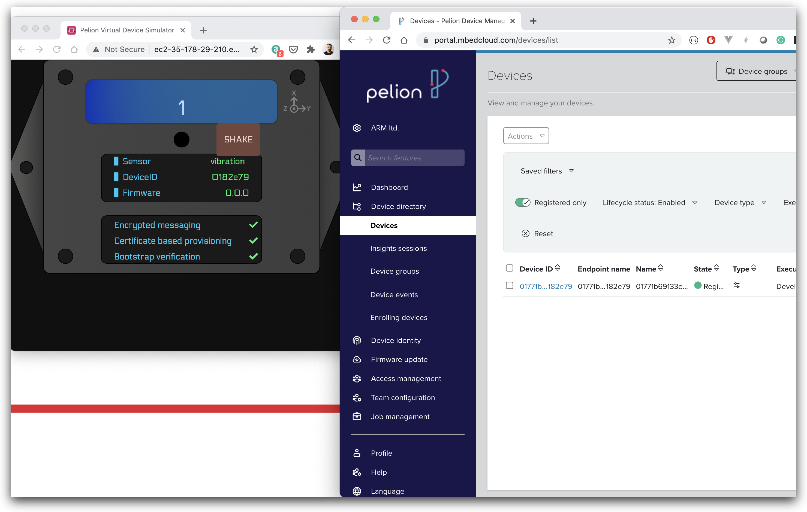

# Pelion Virtual demo
The Pelion Virtual demo is a software only device that connects to the Pelion Device Management service so that the service can be used and demonstrated without the requirement for any device hardware. The project was specifically created to help discussion of high level device management topics with the constraints of travel due to the Covid-19 pandemic but can be used any time that a screen share demo would be useful when a face to face physical demo isn't possible.

An example script is provided that gives an example of where the virtual demo can be used:


## Using the demo
We've made this demo available in two forms
1. Clone this github repo to your local build environment, add your credentials, build and run the client, or
2. Download our VirtualBox VM that comes preconfigured with the build environment in place, add your credentials, finish the build process and run from the VM

In both cases you'll need to have a Pelion Device Management account to use with this demo, visit the [Pelion Device Management](portal.mbedcloud.com) site to sign up for an account if you don't already have one.

Running the demo will register a device to your account and allow you to see and write values to and from the device from the device management service in real time via your Internet link. You can view the Pelion Device Management portal in a browser locally on the same machine that is running the demo, or you can split the demo and the browser accross real and virtual machines, run the portal on one machine and the portal on a second machine, etc.



---
### Clone and build the demo
The demo was written to be built and run in a linux environment using the mbed build tools. If you already have a build environment then you can clone this repo, download a certificate file from the Pelion Device Management service and add it to the mbed-cloud-client-example directory, and build the client portion of this demo.

If you have a working build environment then you can go ahead and clone this repo and add your own mbed_cloud_dev_credentials.c file to the mbed-cloud-linux-client directory and then build with the following commands. If you want to create a build environment then you can follow the steps on the [Mbed installers webpage](https://os.mbed.com/docs/mbed-os/v6.0/build-tools/install-and-set-up.html)

Note the python pal-platform deploy stage requires the python modules `requests` and `click`
```
$ cd pelion-virtual-demo
$ cd mbed-cloud-linux-client
$ mbed deploy
$ python pal-platform/pal-platform.py deploy --target=x86_x64_NativeLinux_mbedtls generate
$ cd __x86_x64_NativeLinux_mbedtls
$ cmake -G "Unix Makefiles" -DCMAKE_BUILD_TYPE=Release -DCMAKE_TOOLCHAIN_FILE=./../pal-platform/Toolchain/GCC/GCC.cmake -DEXTERNAL_DEFINE_FILE=./../define.txt
$ make mbedCloudClientExample.elf
```
Run the linux client application from this location after compiling
```
$ cd Release
./mbedCloudClientExample.elf
```
and kill with `ctrl-C`.

Return to the webapp directory in the pelion-virtual-demo parent folder and install electron and the pelion virtual demo GUI:
```
npm install electron -g
npm install
```

You're now ready to run the webap using
`$ npm start`
Stop the demo by killing the npm instance with `ctrl-C`

### Use our VirtualBox VM
The PDMVirtualDemo VM is an Ubuntu machine that has all of the build tools and project repo installed, and all of the preparation in place for the build process. You can add your credentials file, finish the build process, and run the demo directly from the virtual machine.

The Ubuntu user account is username: pelion-virtual-demo, password: pelion

1. Install VirtualBox, download our virtual machine, and import the image to VirtualBox
2. Run the virtual machine
3. Download a certificate file from your Pelion Device Management account and copy it to the home/pelion-virtual-demo/pelion-virtual-demo/mbed-cloud-client-example directory. You will overwrite the placeholder mbed_cloud_dev_credentials.c file in the client example directory. **HINT** : You may find it easiest to use the Firebox browser inside the virtual machine to log into the Pelion service and download the certificate file directly inside the Ubuntu virtual machine and copy it to the cloud client example directory.
4. Start the terminal app, you can select it from the favourites bar on the left of the Ubuntu desktop
5. Issue the commands to build and run the client example for the first time
```
$ cd pelion-virtual-demo/mbed-cloud-linux-client/__x86_x64_NativeLinux_mbedtls
$ cmake -G "Unix Makefiles" -DCMAKE_BUILD_TYPE=Release -DCMAKE_TOOLCHAIN_FILE=./../pal-platform/Toolchain/GCC/GCC.cmake -DEXTERNAL_DEFINE_FILE=./../define.txt
$ make mbedCloudClientExample.elf
$ cd Release
./mbedCloudClientExample.elf
```
The application will make an initial link to the Pelion Device Management service and you'll see values being updated on screen. Kill the application with `ctrl-C`

6. The application is now built and is now ready for repeated use of this demo.
7. Return to the webapp directory in the pelion-device-demo directory and use npm start to run the demo
```
$ cd ~/pelion-device-demo/webapp
$ npm start
```
8. When you're ready to stop the demo use `ctrl-C` in the terminal to kill the application
